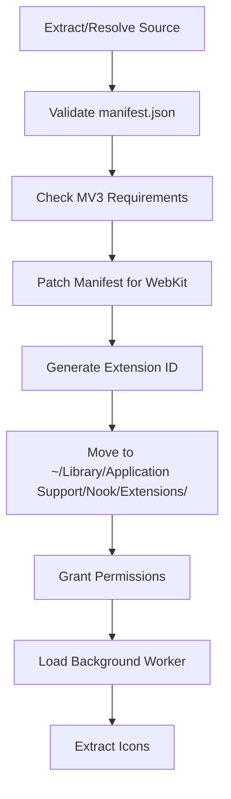

Nook supports browser extensions using WebKit's native `WKWebExtension` API, providing compatibility with Chrome/Firefox extensions while leveraging macOS's built-in extension framework.

## System requirements

Extension support requires:
- **macOS 15.5+** (for content script world isolation)
- **macOS 15.4+** (basic extension support)

Nook automatically detects OS compatibility via `ExtensionUtils.isExtensionSupportAvailable`.

```swift
// Nook/Utils/ExtensionUtils.swift:14
static var isExtensionSupportAvailable: Bool {
    if #available(iOS 18.5, macOS 15.5, *) { return true }
    return false
}
```

## Manifest versions

Nook supports both Manifest V2 and V3 extensions:

<CardGroup cols={2}>
  <Card title="Manifest V3" icon="check">
    Preferred format with service worker backgrounds
  </Card>
  <Card title="Manifest V2" icon="check">
    Legacy format with automatic `scripting` permission injection
  </Card>
</CardGroup>

### Manifest V3 requirements

For MV3 extensions, your manifest must include a service worker:

```json manifest.json
{
  "manifest_version": 3,
  "name": "My Extension",
  "version": "1.0.0",
  "background": {
    "service_worker": "background.js"
  }
}
```

Nook validates this during installation via `validateMV3Requirements()`.

## Creating your first extension

<Steps>
  <Step title="Create the manifest">
    Start with a basic `manifest.json` file:

    ```json manifest.json
    {
      "manifest_version": 3,
      "name": "Hello Nook",
      "version": "1.0.0",
      "description": "My first Nook extension",
      "permissions": ["activeTab"],
      "action": {
        "default_popup": "popup.html",
        "default_icon": {
          "16": "icon16.png",
          "48": "icon48.png",
          "128": "icon128.png"
        }
      }
    }
    ```

    <Note>
      Required fields: `manifest_version`, `name`, `version`. Validation happens in `ExtensionUtils.validateManifest()`.
    </Note>
  </Step>

  <Step title="Create the popup HTML">
    ```html popup.html
    <!DOCTYPE html>
    <html>
      <head>
        <meta charset="UTF-8">
        <style>
          body { width: 300px; padding: 16px; }
          h1 { font-size: 18px; margin: 0 0 12px 0; }
        </style>
      </head>
      <body>
        <h1>Hello from Nook!</h1>
        <button id="test">Click me</button>
        <script src="popup.js"></script>
      </body>
    </html>
    ```
  </Step>

  <Step title="Add popup JavaScript">
    ```javascript popup.js
    document.getElementById('test').addEventListener('click', async () => {
      const tabs = await browser.tabs.query({ active: true, currentWindow: true });
      console.log('Active tab:', tabs[0]);
    });
    ```

    <Note>
      Use `browser` namespace (Firefox style) or `chrome` namespace (Chrome style). Nook supports both.
    </Note>
  </Step>

  <Step title="Package your extension">
    Nook supports multiple installation formats:

    <CodeGroup>
      ```bash Zip archive
      zip -r my-extension.zip manifest.json popup.html popup.js icon*.png
      ```

      ```bash Directory
      # Install directly from folder
      /path/to/my-extension/
      ```

      ```bash Safari .appex bundle
      # Nook automatically extracts web resources
      MyExtension.appex
      ```
    </CodeGroup>
  </Step>
</Steps>

## Installation flow

When you install an extension, Nook performs these steps automatically:



<Note>
  Extension installation code is in `ExtensionManager.swift:1467` (`performInstallation`).
</Note>

### Installation locations

- **Extension packages**: `~/Library/Application Support/Nook/Extensions/{extensionId}/`
- **Native messaging hosts**: `~/Library/Application Support/Nook/NativeMessagingHosts/`

## Permission model

Nook uses an **install-time permission grant model** (Chrome-style):

<Warning>
  ALL `permissions` and `host_permissions` are automatically granted at install time. Users don't see permission prompts during installation.
</Warning>

```swift
// ExtensionManager.swift:1536
for p in webExtension.requestedPermissions {
    extensionContext.setPermissionStatus(.grantedExplicitly, for: p)
}
for m in webExtension.allRequestedMatchPatterns {
    extensionContext.setPermissionStatus(.grantedExplicitly, for: m)
}
```

### Runtime permissions

For `optional_permissions`, users see a permission dialog when your extension calls `browser.permissions.request()`:

```javascript background.js
// Request optional permission at runtime
const granted = await browser.permissions.request({
  permissions: ['bookmarks'],
  origins: ['https://example.com/*']
});
```

## Background service workers

Nook loads background service workers immediately after installation:

```javascript background.js
// MV3 service worker
browser.runtime.onInstalled.addListener(() => {
  console.log('Extension installed!');
});

browser.action.onClicked.addListener(async (tab) => {
  await browser.tabs.sendMessage(tab.id, { action: 'toggle' });
});
```

<Note>
  Background health is automatically probed at +3s and +8s via `probeBackgroundHealth()` to detect initialization issues.
</Note>

## Next steps

<CardGroup cols={2}>
  <Card title="Manifest reference" icon="file-code" href="/extensions/development/manifest">
    Deep dive into manifest structure and WebKit-specific patching
  </Card>
  <Card title="API reference" icon="code" href="/extensions/development/api-reference">
    Explore available browser APIs and native messaging
  </Card>
  <Card title="Debugging" icon="bug" href="/extensions/development/debugging">
    Learn debugging tools and diagnostic utilities
  </Card>
</CardGroup>